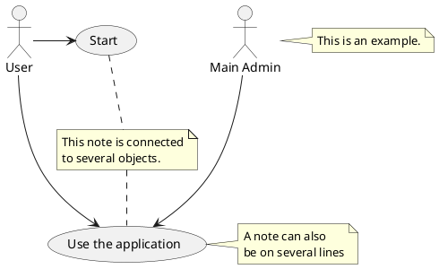

# Tutorials

 [](https://app.fossa.com/projects/git%2Bgithub.com%2Fcoolbeevip%2Ftutorials?ref=badge_shield)
[](https://api.securityscorecards.dev/projects/github.com/coolbeevip/tutorials)

## License
[](https://app.fossa.com/projects/git%2Bgithub.com%2Fcoolbeevip%2Ftutorials?ref=badge_large)

Build & Test

```shell
./mvnw clean package
```

Build & Test on Apple Silicon M1

```shell
./mvnw clean package -Pmacos-m1
```

