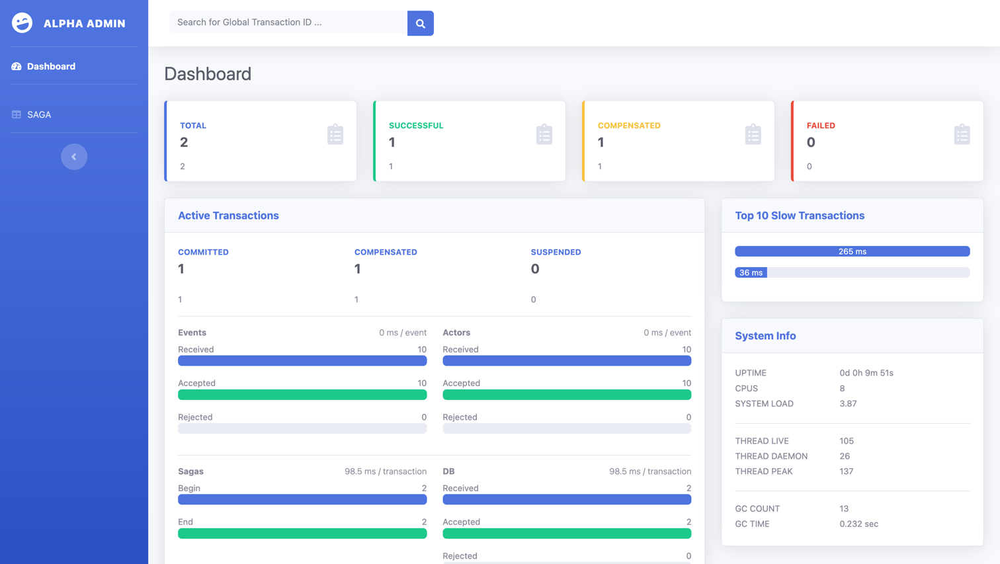
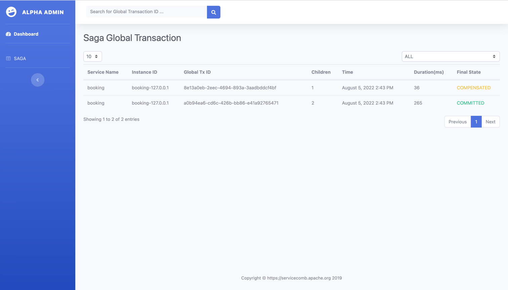
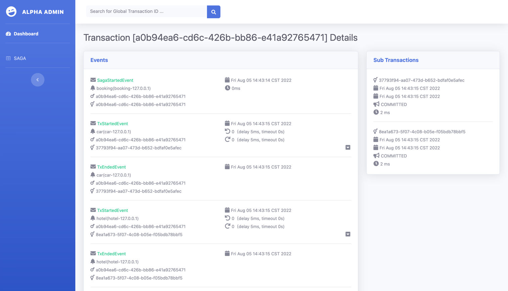

# ServiceComb Pack Distributed Transaction Saga Demo

## Download & Build

```shell
git clone https://github.com/apache/servicecomb-pack.git
./mvnw clean package -DskipTests 
```

## Start ServiceComb Pack Alpha

Start Elasticsearch

```shell
docker run -d --rm --name elasticsearch-pack -p 9200:9200 -p 9300:9300 -e "discovery.type=single-node" elasticsearch:7.17.1
```

Start Alpha

```shell
java -jar alpha/alpha-server/target/saga/alpha-server-0.7.1-exec.jar \
  --server.address=0.0.0.0 \
  --server.port=8090 \
  --alpha.server.port=8080 \
  --alpha.spec.names=saga-akka \
  --alpha.spec.saga.akka.repository.name=elasticsearch \
  --alpha.spec.saga.akka.repository.elasticsearch.uris=http://127.0.0.1:9200
```

## Start Demo

Start Car Service

```shell
java -jar car/target/car-1.0.0-SNAPSHOT-exec.jar \
  --server.port=8001 \
  --omega.spec.names=saga \
  --alpha.cluster.address=127.0.0.1:8080
```

Start Hotel Service

```shell
java -jar hotel/target/hotel-1.0.0-SNAPSHOT-exec.jar \
  --server.port=8002 \
  --omega.spec.names=saga \
  --alpha.cluster.address=127.0.0.1:8080
```

Start Booking Service

```shell
java -jar booking/target/booking-1.0.0-SNAPSHOT-exec.jar \
  --server.port=8000 \
  --omega.spec.names=saga \
  --alpha.cluster.address=127.0.0.1:8080 \
  --car.service.address=http://127.0.0.1:8001 \
  --hotel.service.address=http://127.0.0.1:8002
```
 
## Test

#### Order-1(succeed)

2 room and 1 car

```shell
curl -X POST http://127.0.0.1:8000/booking/order-1/2/1
```

Query car order-1

```shell
$ curl http://127.0.0.1:8001/bookings

[{"id":1,"name":"order-name","amount":1,"confirmed":true,"cancelled":false}]%
```


Query hotel order-1

```shell
$ curl http://127.0.0.1:8002/bookings

[{"id":1,"name":"order-name","amount":2,"confirmed":true,"cancelled":false}]%
```


#### Order-2(failed)

1 room and 11 cars（car limit <=10）

```shell
$ curl -X POST http://127.0.0.1:8000/booking/order-2/1/11
```

Query car order-2

```shell
$ curl http://127.0.0.1:8001/bookings
```

Query hotel order-2

```shell
$ curl http://127.0.0.1:8002/bookings
```

#### UI

Visit http://127.0.0.1:8090/ you can see two transactions, one successful and the other compensated.



You can see two transactions on the Saga list page.



Click on an item to see the transaction details.

